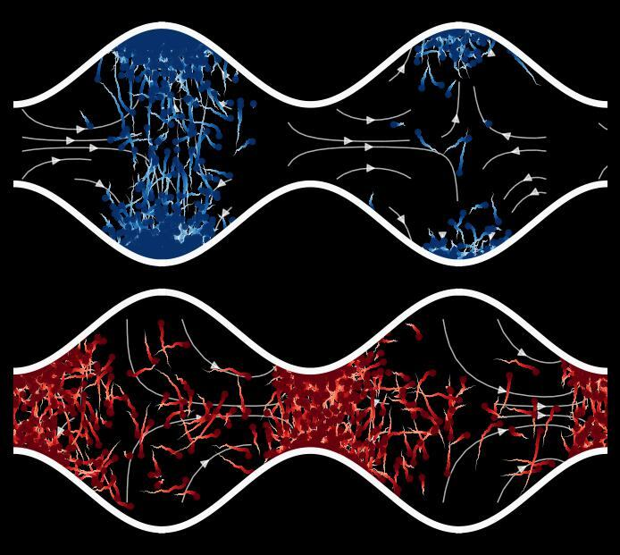
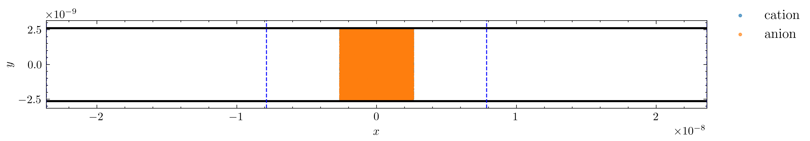

# A GPU-accelerated particle-based solver for charged ions in nanochannels 

**pyPAR² extension**

This repository extends the GPU-based Random Walk Particle Tracking (RWPT) code **PAR²** (Rizzo et al.) from *neutral tracers* to *charged ions*. It adds a **self-consistent electric field** obtained from particle charge density and wall charge via Poisson’s equation and supports both continuum-supplied and particle-computed E-fields. The implementation is GPU-ready (PyTorch + SciPy/CuPy) and is intended as a bridge between RWPT solvers and continuum electrokinetic codes.

 

---

## Table of Contents

1. [Background & Motivation](#background--motivation)
2. [Core ideas and implementation](#core-ideas-and-implementation)
   - [From neutral tracers to charged ions](#from-neutral-tracers-to-charged-ions)
   - [Self-consistent electric field via Poisson’s equation](#self-consistent-electric-field-via-poissons-equation)
   - [Continuum vs particle-based E-field modes](#continuum-vs-particle-based-e-field-modes)
   - [GPU-based particle motion with PyTorch](#gpu-based-particle-motion-with-pytorch)
   - [Field–particle coupling strategy](#field-particle-coupling-strategy)
3. [Governing equations](#governing-equations)
4. [Results](#results)
5. [Applications and impact](#applications-and-impact)

---

## Background & Motivation

Electrokinetic transport in charged nanochannels and porous media is hard to
simulate. These systems feature

- charged walls,  
- overlapping electric double layers,  
- and strong coupling between flow, diffusion, and electromigration,

all happening in complex geometries. Capturing this faithfully requires
resolving the interplay between

- fluid flow,  
- ion migration,  
- diffusion,  
- and electric fields  

in a way that preserves sharp concentration fronts and remains affordable in 2D/3D.

Most existing tools fall into two groups:

- **Eulerian continuum solvers** (Poisson–Nernst–Planck, Poisson–Boltzmann, etc.).  
  These work on fixed grids and can be expensive in complex 2D/3D domains. They also
  tend to introduce numerical diffusion, which can smear sharp concentration fronts.

- **Lagrangian RWPT solvers for neutral solutes.**  
  These are efficient, easy to parallelize (especially on GPUs), and handle
  hydrodynamic dispersion rigorously. However, they usually **do not** include
  electrostatics or multi-species charged ions and therefore ignore ion–field
  feedback altogether.

The **PAR²** code by Rizzo et al. is a GPU-accelerated RWPT implementation for
conservative tracers in porous media. PAR² tracks neutral particles in a given
velocity field and models hydrodynamic dispersion in a rigorous way. But in many
electrokinetic problems, **feedback between ions and the electric field is
essential**:

- Ion distributions modify the electric field.  
- The electric field, in turn, modifies ion motion.  

A neutral RWPT model cannot capture this loop, and classical continuum models
are often too diffusive and too expensive.

What is missing is a **GPU-ready, particle-based electrokinetic solver** that:

- tracks individual ions as particles,  
- computes a **self-consistent** electric field from their charge distribution
  and wall charge via Poisson’s equation,  
- and can still interface cleanly with existing continuum solvers.

This project aims to bridge that gap by coupling a particle-based RWPT solver
with continuum electrostatics to build a self-consistent, GPU-accelerated
electrokinetic transport framework.

---

## Core ideas and implementation

This repository takes the PAR² RWPT idea and extends it in three main directions:

1. From neutral tracers to **charged ion species**.  
2. A **self-consistent electric field** computed by solving Poisson’s equation.  
3. A flexible coupling between **continuum** and **particle-based** E-field descriptions,  
   with GPU-accelerated RWPT implemented in PyTorch.

### (a) From neutral tracers to charged ions

Particles are no longer just passive solute markers.  
Each particle belongs to a **species** (cation, anion, neutral). Each species has:

- an integer charge number $z_m$,  
- a diffusion coefficient $D_m$,  
- an electrophoretic mobility

$$
\mu_e = \frac{D_m z_m q_e}{k_B T}.
$$

The code initializes a mixture of species with user-defined fractions.  
The RWPT update then includes both:

- **advection** by the fluid velocity,  
- **drift** in the electric field due to electrophoresis.

### (b) Self-consistent electric field via Poisson’s equation

The code can compute the electric field **self-consistently** from particle charges and
wall charge.

At selected time steps, it:

1. Deposits particle charges on a structured grid to build a volumetric charge
   density $\rho_c(x, y)$.
2. Adds a surface charge on the top and bottom walls, using a flexible profile:
   - uniform charge,
   - sinusoidal charge,
   - absolute sinusoidal charge.
3. Solves a Poisson problem

$$
-\varepsilon \nabla^2 \Phi = \rho_c
$$

   with:
   - periodic boundary conditions in $x$,
   - Neumann boundary conditions at the walls based on the given surface charge.
4. Computes the electric field as

$$
\mathbf{E} = -\nabla \Phi
$$

   on the same structured grid used for RWPT.

The Poisson solver uses high-order compact finite-difference schemes. The global
system is assembled as a sparse matrix and solved either:

- on the CPU with SciPy sparse linear algebra, or  
- on the GPU with CuPy-based iterative solvers (when available).

The updated field $\mathbf{E}(x, y)$ is then interpolated back to particle
positions and used in the next RWPT update.

### (c) Continuum vs particle-based E-field modes

The code supports two E-field modes:

- **Continuum mode** (`use_continuum_E = True`):
  - The electric field comes from an external continuum solver (e.g. Stokes /
    electrokinetic code).
  - The field is loaded from file and interpolated onto the RWPT grid.
  - No Poisson solve from particles is performed.
- **Self-consistent mode** (`use_continuum_E = False`):
  - The electric field is recomputed from particle charge density + wall charge
    by solving Poisson’s equation.

This makes it possible to:

- compare particle-based and continuum models on the same geometry,  
- start from a continuum field and later include feedback from particles,  
- test how different surface-charge patterns affect ion transport.

### (d) GPU-based particle motion with PyTorch

The RWPT part is implemented in **PyTorch**.

All particle positions and velocities are stored as tensors on the chosen device:

- CUDA GPU (if available),
- Apple MPS,
- or CPU as fallback.

The code can track up to $10^5$–$10^6$ particles over millions of time steps.  
Snapshots of the particle states are stored to disk as NumPy arrays.

Utilities are provided to:

- restart a simulation from the last snapshot,
- plot “unfolded” particle positions in a periodic channel,
- separate species and visualize them with different colors.

### (e) Field–particle coupling strategy

Putting the pieces together, the code performs a coupled field–particle update at selected times $t_k$:

1. **Aggregate positions**: collect particle coordinates $\mathbf{x}_i(t_k)$.
2. **Form $\rho_c(\mathbf{x})$**: bin particles into voxels and construct the charge density.
3. **Solve Poisson**: compute $\Phi$ and $\mathbf{E} = -\nabla \Phi$; store $(\Phi, \mathbf{E})$.
4. **Update field**: inject the new field into the particle simulator.
5. **Advance particles**: integrate the next block of Brownian steps with electrostatic forces.

Coupling does not occur at every micro-step; instead we choose a stride $n_{\mathrm{BD}} \in \mathbb{N}$.  
Particles advance $n_{\mathrm{BD}}$ RWPT steps between field updates.

---
## Governing equations

The electrostatic potential $\Phi(\mathbf{x})$ is governed by Poisson’s equation:

$$
-\varepsilon \nabla^2 \Phi(\mathbf{x}) = \rho_c(\mathbf{x}),
$$

where

- $\varepsilon$ is the permittivity of the medium,
- $\Phi(\mathbf{x})$ is the electrostatic potential,
- $\rho_c(\mathbf{x})$ is the volumetric charge density.

Equivalently, the electric field is

$$
\mathbf{E}(\mathbf{x}) = -\nabla \Phi(\mathbf{x}), \qquad
\nabla \cdot \mathbf{E}(\mathbf{x}) = \rho_c(\mathbf{x}).
$$

In an electrolyte, $\rho_c(\mathbf{x})$ is determined by the local number densities of cations and anions. At the continuum level, we write

$$
\rho_c(\mathbf{x}) = e_0 \bigl(c^+(\mathbf{x}) - c^-(\mathbf{x})\bigr),
$$

where

- $e_0$ is the elementary charge,
- $c^+(\mathbf{x})$ is the cation concentration,
- $c^-(\mathbf{x})$ is the anion concentration.

In the particle-based simulation, these concentrations are constructed directly from particle positions. We discretize the domain into voxels $\mathcal{V}_j$ of volume $\Delta V$. From instantaneous particle positions, we form voxel counts $N_j^{+}$ and $N_j^{-}$ for cations and anions, respectively. The corresponding number concentrations are approximated as

$$
c^{+}(x_j) \approx \frac{N_j^{+}}{\Delta V}, \qquad
c^{-}(x_j) \approx \frac{N_j^{-}}{\Delta V}.
$$

Substituting the voxel-based expressions for ion concentrations into the volumetric
charge-density relation gives a **piecewise-constant estimator** for $\rho_c$ on the grid.

**Statistical rescaling.** In practice, the real system may contain $N_{\text{real}}$ ions, while we simulate $N_{\text{sim}} \gg N_{\text{real}}$ independent Brownian trajectories. We rescale the simulated charge density so that

$$
\rho_c^{\text{real}}(\mathbf{x}) =
\frac{N_{\text{real}}}{N_{\text{sim}}}\.
\rho_c^{\text{sim}}(\mathbf{x}).
$$

This preserves the spatial structure of the simulated ion clouds while ensuring consistency with the physical number density used in the Poisson solve.

---

## Results

  

The figure above shows the initial particle configuration in the pore. The domain is a 2D nanochannel with periodicity in the streamwise direction and charged walls at the top and bottom. Particles are initialized according to user-specified species fractions and spatial distributions, and then evolved using the RWPT + electrokinetic rules described above.

The animation below illustrates the evolution of the same particle ensemble in the presence of an applied electric field. Charged species experience electrophoretic drift superimposed on advection and diffusion, leading to the formation of ion plumes and reorganization of charge near the walls. This is the fully coupled electrokinetic RWPT mode, where the electric field is updated from the prescribed electric field.

The final animation shows the fully self-consistent electrokinetic RWPT mode implemented in this project. Here, the electric field is no longer imposed from outside: it is recomputed from the particle-derived charge density and wall charge by solving Poisson’s equation at coupling times. As particles move, they reshape the charge density, which in turn updates the electric field, closing the feedback loop between ion transport and electrostatics.

---

## Applications and impact

This project turns a neutral RWPT code into a **particle-based electrokinetic
simulator**.

It keeps the advantages of RWPT:

- low numerical diffusion,
- natural handling of complex pore geometries.

At the same time, it adds essential physics for:

- charged species,
- electrostatic interactions,
- and feedback between ions and the electric field.

With this code, you can:

- Study how cation and anion plumes evolve in a charged nanochannel.
- Explore the impact of different wall-charge patterns on ion transport.
- Compare continuum E-fields with self-consistent particle-based fields.
- Test new ideas for electrokinetic devices without rewriting the full solver.

From a **research** point of view, the code provides:

- a bridge between **PAR²-style RWPT** and **Poisson-based electrostatics**,
- a flexible platform for **multi-species ion transport**,
- a way to analyze how micro-scale charge distributions feed back on macroscopic transport.

From a **practical** point of view:

- The code is GPU-ready.
- It reads geometry and flow fields from existing continuum solvers.
- It can be extended to more species, different wall models, or new boundary conditions.

In short, this repository is a step toward **self-consistent, particle-based
electrokinetic modeling** on top of a well-tested RWPT backbone.
