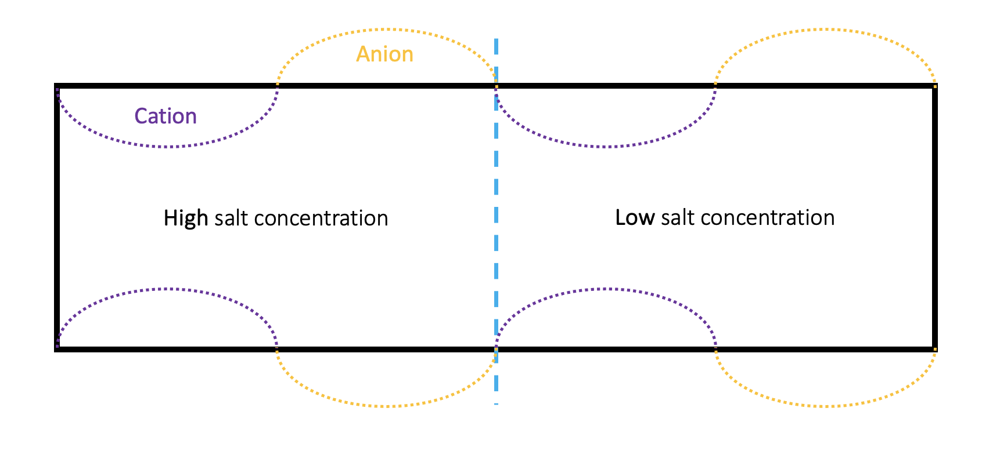

# PetersenLAB

# Coupling Particle Simulations with Continuum Electrostatics
**Computing Electric Fields from Particle-Derived Charge Densities**  
*Author: Pouya Golchin*

> This project couples GPU-accelerated Brownian particle simulations with continuum electrostatics. The central idea is to compute the columetric charge density directly from particle positions, then solve Poisson's equation to obtain the electric potential and field. This enables (i) validation against continuum electrokinetic models and (ii) quantification of electric-double-layer screening at charged walls.

---

## Table of Contents
- [Background](#background)
- [Governing Equations](#governing-equations)
- [Charge Density from Particle Simulations](#charge-density-from-particle-simulations)
- [Field Solution Strategy](#field-solution-strategy)

---

## Background
This study bridges continuum electrochemical equations with particle-based simulations in nanoscale pores. Instead of always prescribing the electric field from a continuum solver, we periodically **measure** the charge density \( \rho_c(\mathbf{x}) \) from particle positions and solve the field self-consistently. This provides a complementary view on screening and equilibrium structure and leverages GPU parallelism to generate many realizations of ion positions.

---

## Governing Equations
The electrostatic potential $\Phi(x)$ is governed by Poisson’s equation:

$$
-\varepsilon \nabla^2 \Phi(x) = \rho_c(x)
$$

where $\varepsilon$ is the permittivity of the medium, $\Phi(\mathbf{x})$ is electrostatic potential, and $\rho_c$ is the volumetric charge density distribution.

Equivalently, the electric field is 

$$
\mathbf{E}(x) = -\nabla \Phi(x), \qquad \nabla \cdot \mathbf{E}(x) = \rho_c(x).
$$

To compute $\rho_c(\mathbf{x})$, we consider the local density of cations and anions in each voxel of the simulation domain. The volumetric charge density is:

$$
\rho_c(x) = e_0 \big(c_{+}(x) - c_{-}(x)\big),
$$

where $e_0$ is the elementary charge, $c_{+}$ is the cation concentration, and $c_{-}$ is the anion concentration.

---

## Charge Density from Particle Simulations
Discretize the domain into voxels $\mathcal{V}_j$ with volume $\Delta V$. From instantaneous particle positions,
form voxel counts $N^{+}_j$ and $N^{-}_j$. The corresponding number concentrations are:

$$
c_{+}(x_j) \approx \frac{N^{+}_j}{\Delta V}, \qquad
c_{-}(x_j) \approx \frac{N^{-}_j}{\Delta V}.
$$

Substituting the voxel-based expression for ion concentrations into volumetric charge density relation gives a piecewise-constant estimator for $\rho_c$.

**Statistical rescaling.** If the real system contains $N_{\mathrm{real}}$ ions but we simulate $N_{\mathrm{sim}}\gg N_{\mathrm{real}}$ independent Brownian trajectories, then

$$
\rho_c^{\mathrm{real}}(x) = \frac{N_{\mathrm{real}}}{N_{\mathrm{sim}}}\,\rho_c^{\mathrm{sim}}(x).
$$

This approach preserves the spatial structure of the simulated ions while ensuring consistency with the physical number density.

---

## Field Solution Strategy
At selected coupling times $t_k$:

1. **Aggregate positions:** collect particle coordinates $\{x_i(t_k)\}$.
2. **Form $\rho_c(x)$:** bin particles to voxels.
3. **Solve Poisson:** compute $\Phi$ and $\mathbf{E}=-\nabla\Phi$; store $(\Phi,\mathbf{E})$.
4. **Update field:** inject the new field into the particle simulator.
5. **Advance particles:** integrate the next block of Brownian steps with electrostatic forces.

Coupling does not occur every micro-step; choose a stride $n_{\mathrm{BD}}\in \mathbb{N}$ (particles advance $n_{\mathrm{BD}}$ steps between field updates).

---

## RWPT–Continuum Coupling: Visualization

This visualization shows the **Random Walk Particle Tracking (RWPT)** simulation of charged ions in a nanoscale channel. The upper panels display the normalized ion concentration profiles of anions (orange) and cations (purple) across the channel, while the lower panels show the corresponding particle positions at different times.

Initially, particles are uniformly distributed within one pore, with roughly $10^5$ trajectories initialized randomly across the domain. To drive the system, we impose the electrostatic potential and velocity fields obtained from a **continuum electrokinetic solver**. These fields act as external forces on the ions, steering their motion over time.

As the simulation progresses, the cations and anions redistribute and self-organize into regions consistent with the applied electric field. The ions accumulate preferentially in zones where the field aligns with their charge polarity, while being excluded from unfavorable regions. This dynamic adjustment demonstrates how microscopic particle transport reflects the macroscopic electrostatic structure.

The results highlight a key insight: instead of always prescribing fields from continuum mechanics into particle simulations, we can **invert the workflow**. By measuring particle positions, constructing the charge density, and solving Poisson’s equation, we can directly obtain the electric field from RWPT simulations. This reverse coupling provides a pathway to validate continuum models and to quantify screening effects from the particle perspective.

---

## Future Test Case: Salt-Asymmetric Channel with Sinusoidal Wall Charge

Later, this method will be tested on a more challenging configuration: a channel with **two different bulk salt concentrations** (left vs. right) and **sinusoidally varying surface charges** along the walls.

- **Setup:** The left reservoir contains a high salt concentration, while the right reservoir has a low salt concentration. This concentration gradient naturally drives ions across the interface.  
- **Boundary forcing:** The top and bottom walls are decorated with sinusoidal charge patterns, alternating between cation-attracting and anion-attracting regions.  
- **Expected outcome:** The combined action of the salt gradient and the oscillatory wall charges should produce a spatially modulated ion distribution, with electric fields that cannot be captured by simple uniform-wall models.

This example serves as a validation benchmark: if the RWPT-derived charge density $\\rho_c(\\mathbf{x})$ correctly reproduces the field structure predicted by continuum electrostatics, it demonstrates the robustness of the **particle-to-field coupling** framework.

  

